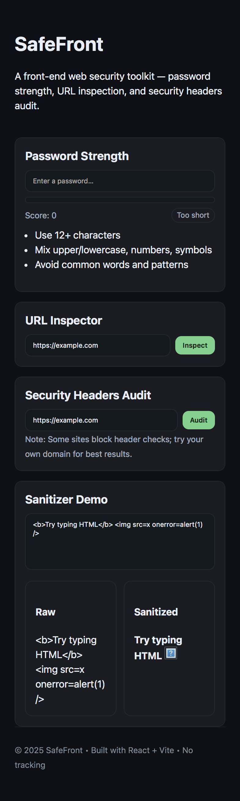
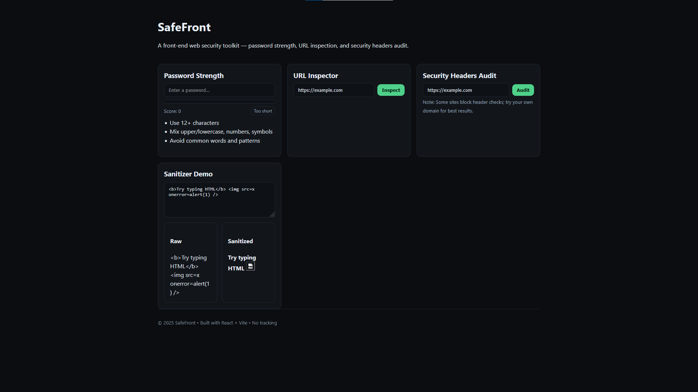

# SafeFront

[](https://safefront-eight.vercel.app/)


**SafeFront** is a front‑end web security toolkit built with **React + Vite**.  
It includes a password strength tool, a suspicious URL inspector, a **security headers audit** (via API), and an **XSS sanitization** demo using DOMPurify.

🔗 **Live Demo**: https://safefront-eight.vercel.app/

---

## ✨ Features
- **Password Strength Checker** – entropy/length/character classes
- **URL Inspector** – flags punycode, IP hosts, suspicious TLDs, many subdomains, and non‑HTTPS
- **Security Headers Audit** – backend fetch to site and reports CSP, HSTS, XFO, X‑CTO, Referrer‑Policy, Permissions‑Policy
- **Sanitizer Demo** – shows how DOMPurify prevents XSS
- **Clean UI** – responsive, lightweight

---

## 🛠 Tech Stack
- **Frontend**: React, Vite, CSS
- **Security**: DOMPurify
- **API**: Serverless endpoint on Vercel (`/api/headers`)
- **Hosting**: Vercel

---

## 📂 Structure
```
safefront/
├─ api/                 # Vercel serverless functions
│  └─ headers.js        # GET /api/headers?url=...
├─ server/              # Local dev Express server (optional)
│  └─ index.js
├─ src/
│  ├─ components/       # UI widgets
│  ├─ sections/         # Tools pages
│  ├─ App.jsx
│  ├─ main.jsx
│  └─ index.css
├─ package.json
├─ vite.config.js
└─ index.html
```

---

## 🔧 Local Setup
```bash
npm install
npm run dev:api   # starts local API (optional for dev)
npm run dev       # starts Vite (http://localhost:5173)
```

> Vite proxies `/api` to `http://localhost:5174` during dev (see `vite.config.js`).

---

## 🌐 Deployment
Deployed on **Vercel** (zero config):
- **Build:** `npm run build`
- **Output:** `dist`
- **API:** `api/headers.js` → `/api/headers`

Live: https://safefront-eight.vercel.app/

---

## 🔎 API: Security Headers Audit
**Endpoint**
```
GET /api/headers?url=https://example.com
```

**Response**
```json
{
  "ok": true,
  "url": "https://example.com/",
  "status": 200,
  "headers": { "content-security-policy": "...", "strict-transport-security": "..." },
  "audit": {
    "hsts": true,
    "csp": true,
    "xFrameOptions": true,
    "xContentTypeOptions": true,
    "referrerPolicy": true,
    "permissionsPolicy": false,
    "httpsRedirectLikely": true
  }
}
```

---

## 📸 Screenshots
### Mobile View


### Desktop View


---

## 🧪 Troubleshooting
- **`react/jsx-runtime` not found** → ensure `react` and `react-dom` are installed (18.x) and `@vitejs/plugin-react` is enabled in `vite.config.js`.
- **404 on `/api/headers` in prod** → file must be at repo root: `api/headers.js`.
- **CORS locally** → use `npm run dev:api` + Vite proxy (already set).

---

## 🏷 GitHub Topics
```
react vite javascript security web-security http-headers xss dompurify vercel
```

---

## 📄 License
MIT — see `LICENSE`.